# 实验一

## 购买腾讯云服务器并登录

1.购买腾讯云服务器 学生套餐 

2.使用Web Shell登录已购买的云服务器实例 

3.下载安装X Shell（包含在X manager中），并使用 X shell登录腾讯云实例

### 实验结果

使用Web Shell登入云服务器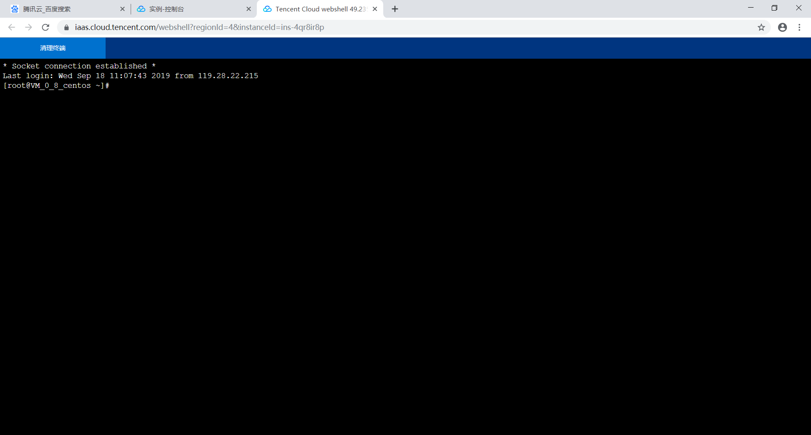

使用X shell 登入云服务器

（1）配置X shell相关信息

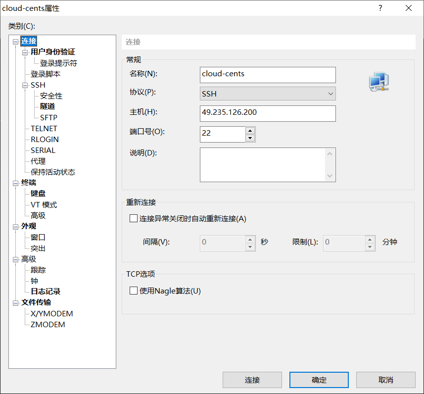

（2）X shell 登入云服务器

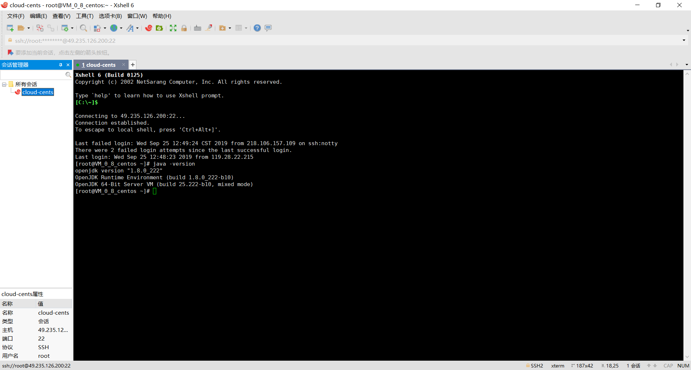

# 实验二

## 创建GitHub项目并在本地同步

1.注册GitHub账号：https://github.com/ 

2.在GitHub上创建云计算项目（CloudComputing）并在本地同步

### 实验结果

（1）创建云计算仓库

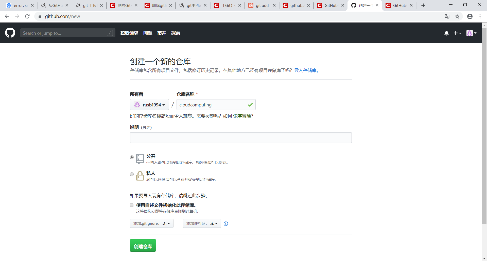

（2）同步项目

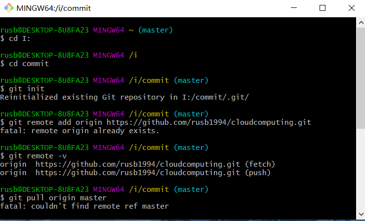

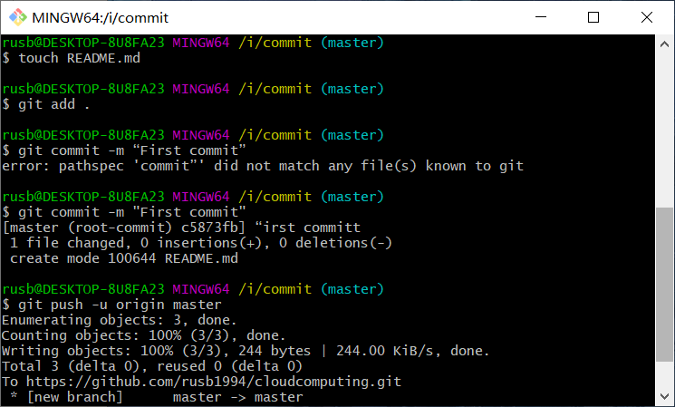

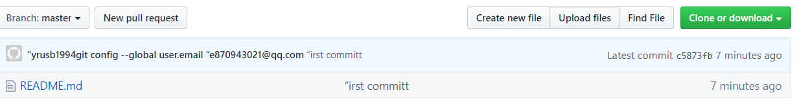

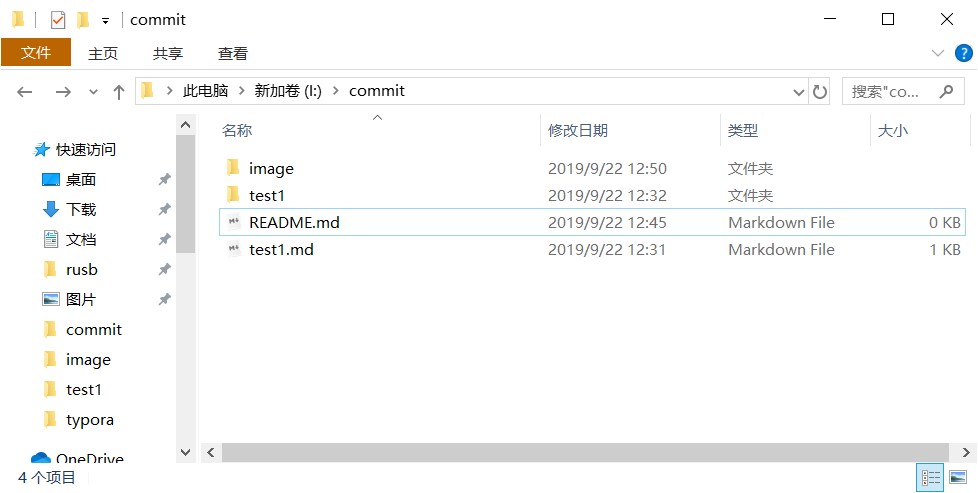

# 实验三

## 本地安装VMware Workstation和CentOS操作系统

1.自行安装VMware WorkStation  任何版本都行，视自己机器的配置而定，比如VMware WorkStation9，12，或者15都可，版本越高要求的机器配置越 高。 

2.在VMware WorkStation安装CentOS操作系统 

### 实验结果

（1）安装VMware Workstation

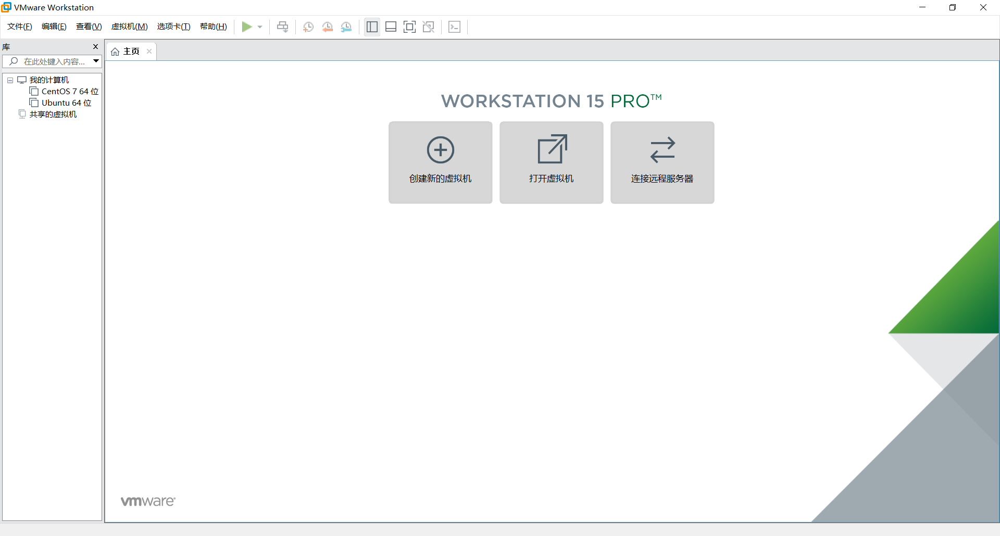

（2）安装CentOS 

①下载CentOS镜像

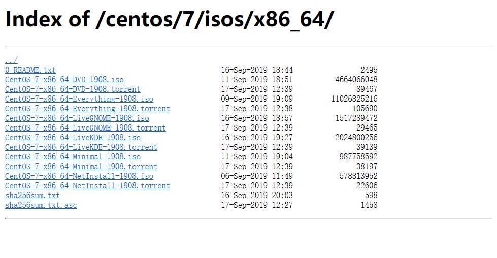

②在vmware中安装CentOS镜像

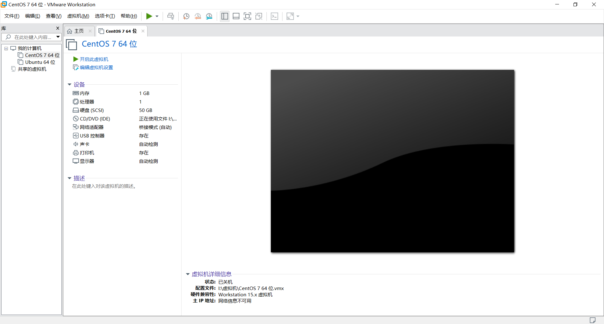

③安装centOS系统

