# Ceph安装与实践——何俊杰（116072017001）

## 一.下载并安装CentOS

1.从阿里云上下载centos镜像

http://mirrors.aliyun.com/centos/7/isos/x86_64/

2.安装centos镜像（选择最小化安装）

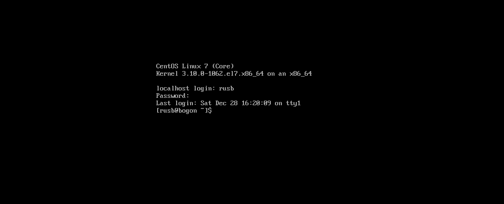

## 二.准备工作

#### 1.为操作方便使用Xshell连接虚拟机

##### （1）获取虚拟机IP地址

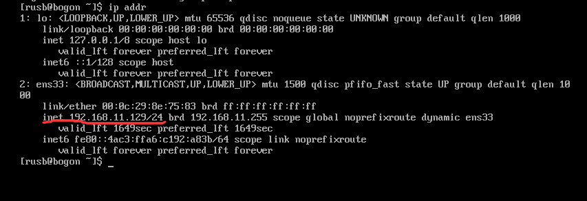

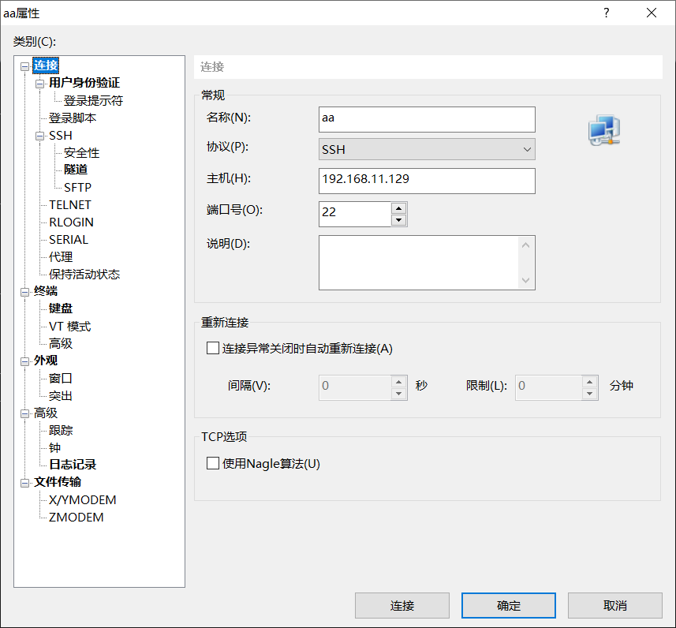

#### 2.配置sudo权限

```
echo "rusb ALL = (root) NOPASSWD:ALL" | sudo tee /etc/sudoers.d/rusb

chmod 0440 /etc/sudoers.d/rusb

sed -i s'/Defaults requiretty/#Defaults requiretty'/g /etc/sudoers
```

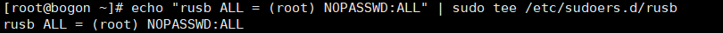

#### 3.安装ntp服务

```
yum install -y ntp ntpdate ntp-doc

ntpdate 0.us.pool.ntp.org

hwclock --systohc

systemctl enable ntpd.service

systemctl start ntpd.service
```

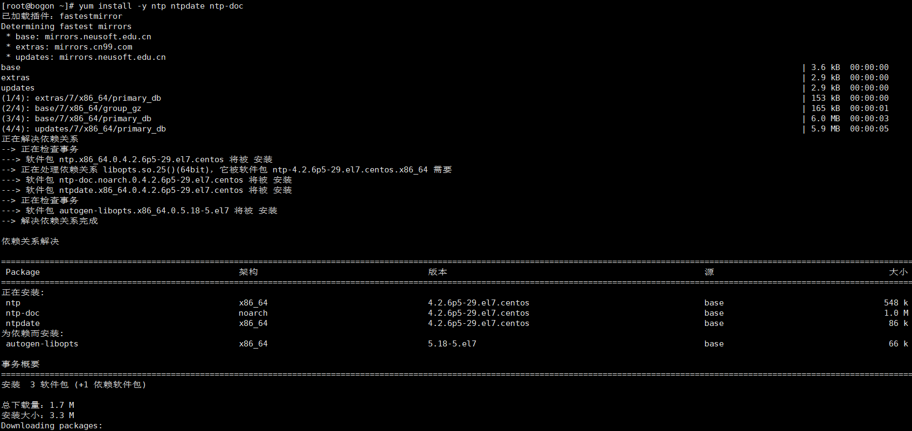

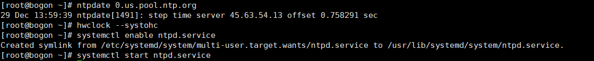

#### 4.给虚拟机安装vm-tools

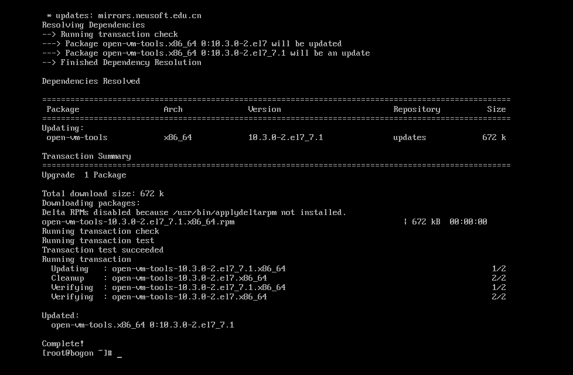

#### 5.禁用SELINUX

```
sed -i 's/SELINUX=enforcing/SELINUX=disabled/g' /etc/selinux/config
```

#### 6.复制虚拟机

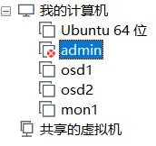


#### 7.防火墙配置

```
<1>主控节点防火墙

sudo firewall-cmd --zone=public --add-port=80/tcp --permanent

sudo firewall-cmd --zone=public --add-port=2003/tcp --permanent

sudo firewall-cmd --zone=public --add-port=4505-4506/tcp --permanent

sudo firewall-cmd –reload

<2>monistor节点防火墙

sudo firewall-cmd --zone=public --add-port=6789/tcp --permanent

sudo firewall-cmd --reload

<3>普通节点防火墙

sudo firewall-cmd --zone=public --add-port=6800-7300/tcp --permanent

sudo firewall-cmd –reload
```

#### 8.为osd守护进程创建目录

```
osd1节点：

sudo mkdir /var/local/osd1

sudo chown ceph:ceph /var/local/osd1

osd2节点：

sudo mkdir /var/local/osd2

sudo chown ceph:ceph /var/local/osd2
```

### 三.主控例程配置

##### 1.添加配置

```
vi /etc/hosts
#添加如下配置
IP1 ceph-admin

IP2 mon1

IP3 osd1

IP4 osd2
```

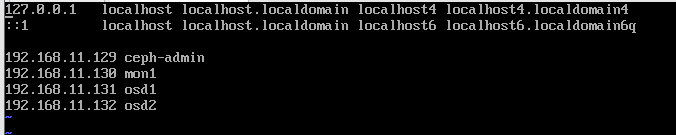


##### 2.设置免密登入

```
su - cephuser
ssh-keygen
```

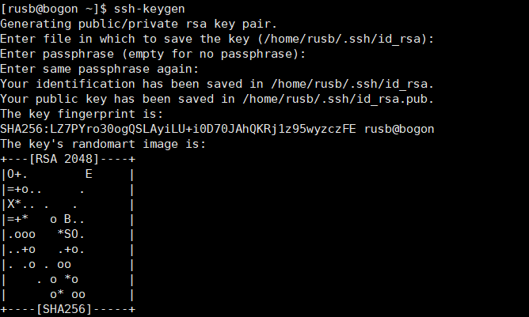

##### 3.配置

```
vi ~/.ssh/config

sudo chmod 644 ~/.ssh/config

ssh-keyscan osd1 osd2 mon1 >> ~/.ssh/known_hosts
```

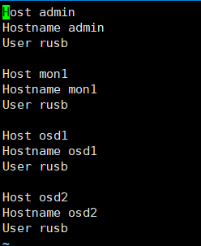

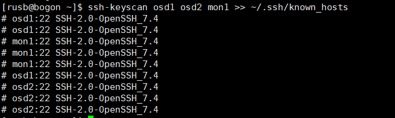

4.分发密钥

```
ssh-copy-id mon1

ssh-copy-id osd1

ssh-copy-id osd2
```

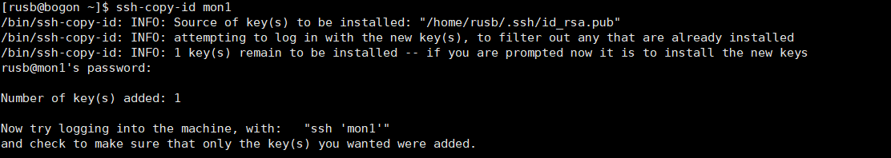

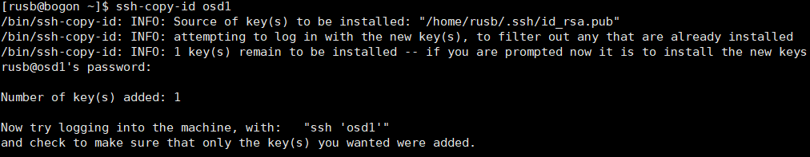

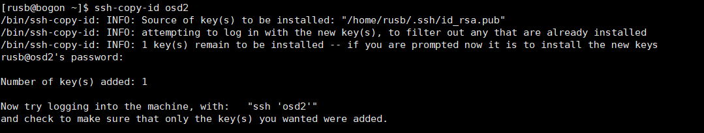

##### 5.测试连接各节点ssh

```
ssh osd1

ssh osd2

ssh mon1
```

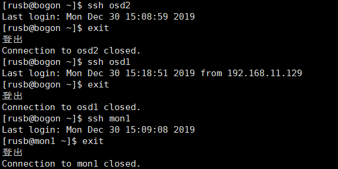

##### 6.ceph-deploy安装

```
sudo rpm -Uhv http://download.ceph.com/rpm-jewel/el7/noarch/ceph-release-1-1.el7.noarch.rpm

sudo yum update -y

sudo yum install ceph-deploy -y

ceph-deploy –version
```

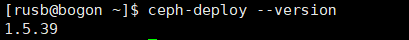


##### 7.创建集群

```
mkdir my-cluster && cd my-cluster

ceph-deploy new mon1

vi ceph.conf

osd pool default size = 2

public network = {ip-address}/{netmask}
```

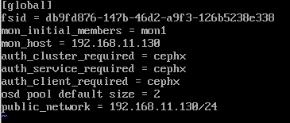


##### 8.修改mon1节点主机名为mon1

```
hostnamectl set-hostname mon1
```

##### 9.在各个节点安装ceph

```
ceph-deploy install ceph-admin mon1 osd1 osd2
```

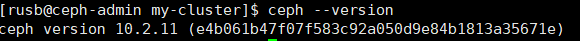

##### 10.初始化mon1节点

```
ceph-deploy mon create-initial

ceph-deploy gatherkeys mon1
```

完成后会多出几个密钥文件

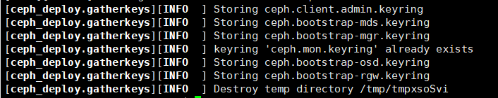

##### 11.将OSDS添加到集群

```
ceph-deploy osd prepare osd1:/var/local/osd1 osd2:/var/local/osd2

ceph-deploy osd activate osd1:/var/local/osd1 osd2:/var/local/osd2
```

##### 12.将管理密钥部署到所有关联的节点

```
ceph-deploy admin ceph-admin mon1 osd1 osd2
```

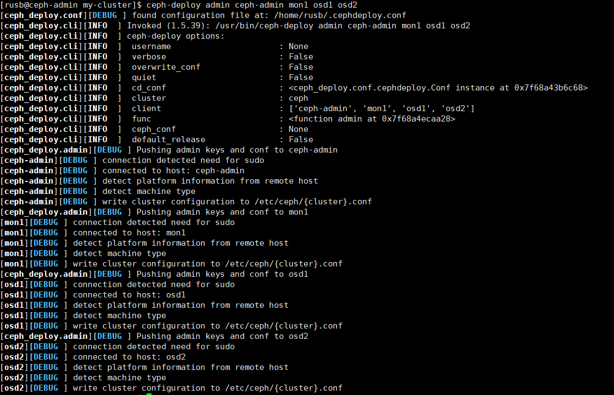

##### 13.所有节点执行命令更改密钥文件的权限

```
sudo chmod 644 /etc/ceph/ceph.client.admin.keyring

ceph-deploy disk list osd1 osd2
```

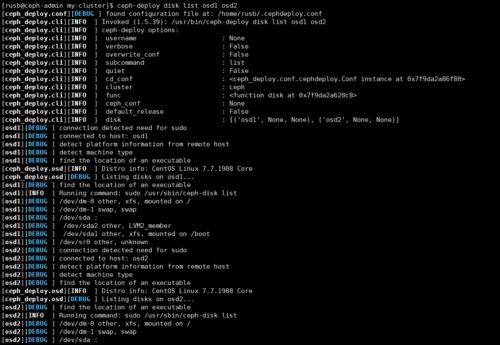

### 四.检查集群状态

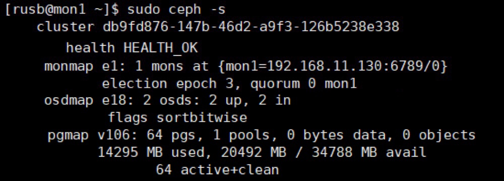