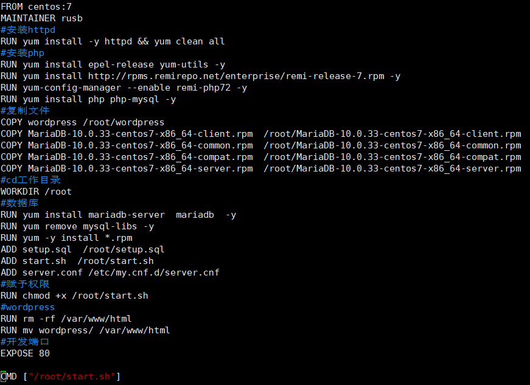
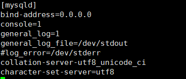
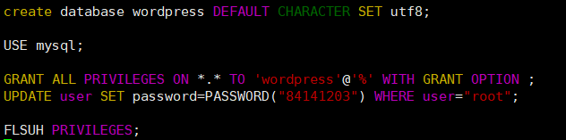
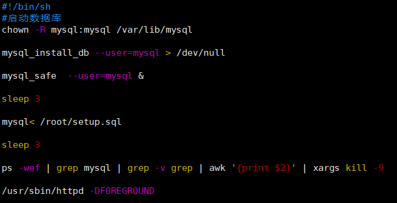
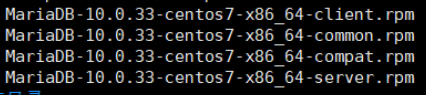
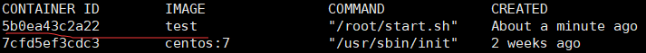
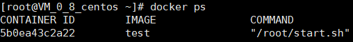
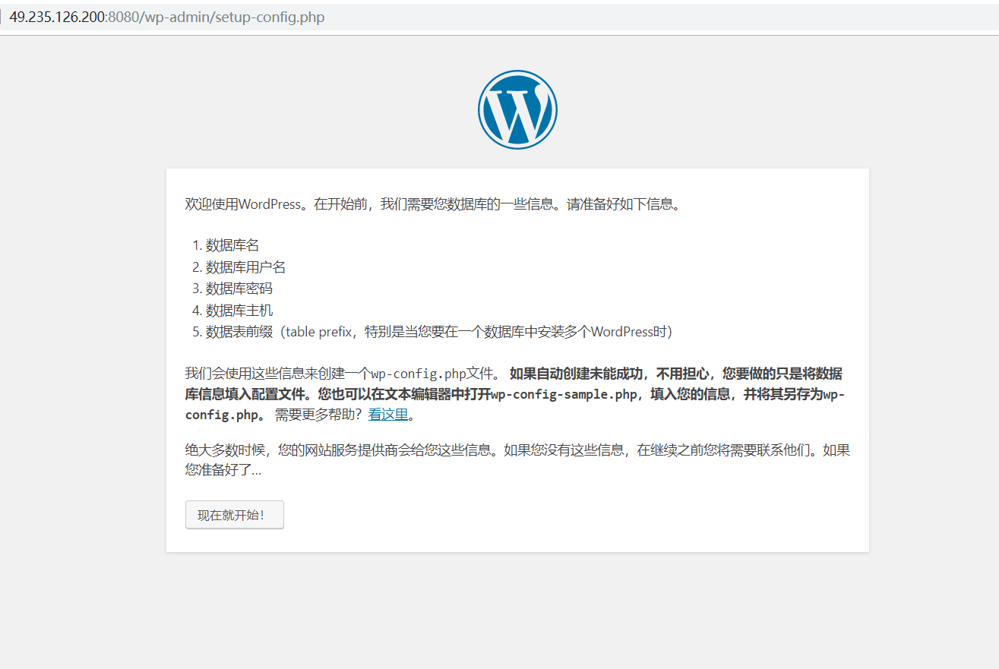

# Docker基础实验——116072017001（何俊杰）

## 实验一：安装Docker

更新应用程序数据库：

```
sudo yum check-update
```

添加Docker的官方仓库，下载最新的Docker并安装：

```
curl -fsSL https://get.docker.com/ | sh
```

启动Docker

```
sudo systemctl start docker
```

设置Docker自启动

```
sudo systemctl enable docker
```

查看Docker 版本信息

```
docker version
```


## 实验二：完成Docker安装之后加载CentOS镜像

### 1.Docker加载CentOS镜像

**拉取 Centos 7**

```
docker pull centos:7
```

  查看一下当前系统中存在的镜像：

```
docker images
```


**运行Docker容器**

```
docker run -d -it --privileged --name wordpress -p 8888:80 -d centos:7 /usr/sbin/init
```

**查看已启动的容器**

```
docker ps
```


**进入容器前台**

```
docker exec -it 7cfd5ef3cdc3 /bin/bash
```

### 2.容器中安装wordpress

参考文章：[Centos上搭建wordpress](https://github.com/rusb1994/cloudcomputing/blob/master/website/website.md)

安装完成后可通过浏览器访问 服务器IP:8888 查看


### 3.推送带有wordpress的镜像

**将容器生成镜像 (**

```
docker commit -a "rusb1994" -m "wordpress on centos7" 7cfd5ef3cdc3 rusb1994/centos:v1
```

**登录Docker**

```
docker login
```

**推送镜像**

```
docker push rusb1994/centos:v1
```


## 实验三：利用Dockerfile文件创建包含WordPress的镜像

**1.编写Dockerfile文件**



**2.编辑server.conf**



**3.编辑setup.sql**



**4.编写start.sh启动脚本**



**在构建镜像前下载**



**并将它们放在与Dockerfile文件同一目录下**

**5.构建镜像**

```
docker build -t test .
```



**6.运行并设置端口映射**

```
docker run -dit -p 8080:80 test
```



**7.进入容器**

```
docker exec -it 5b0 /bin/bash
```

**8.浏览器进入49.235.126.200:8080**



